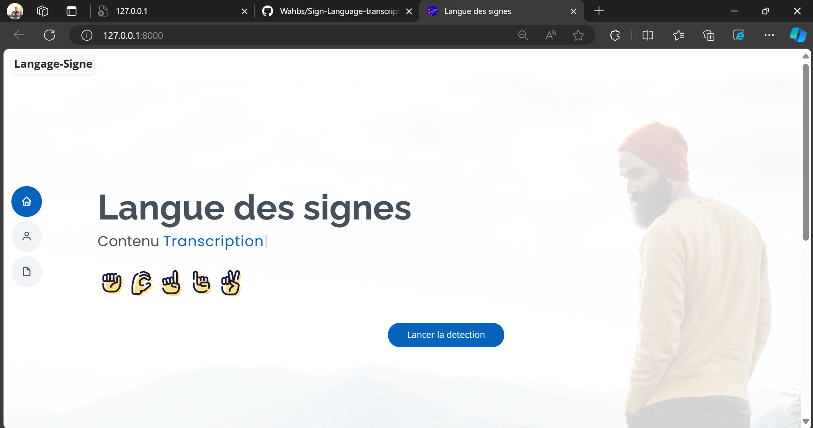
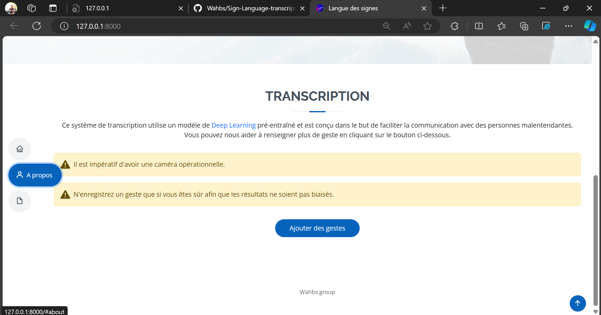
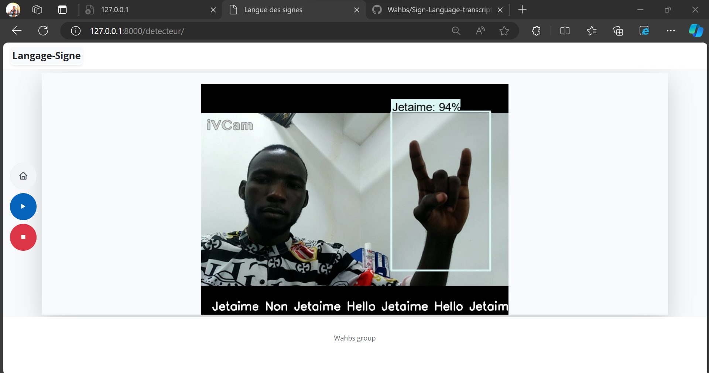
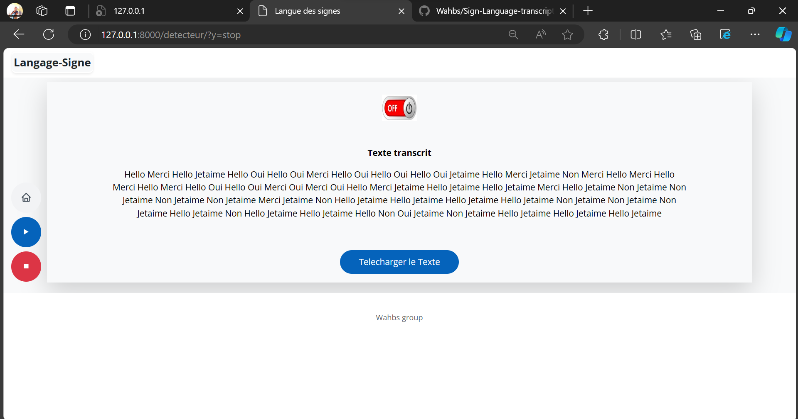
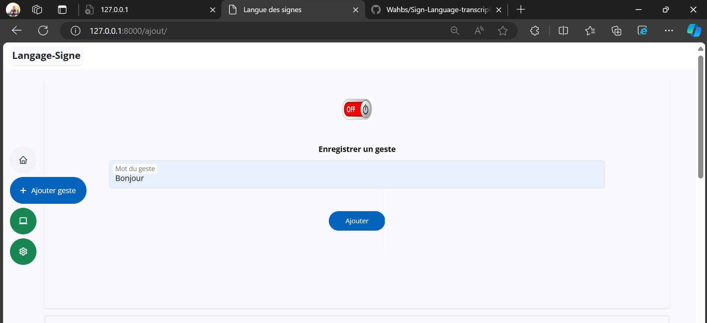
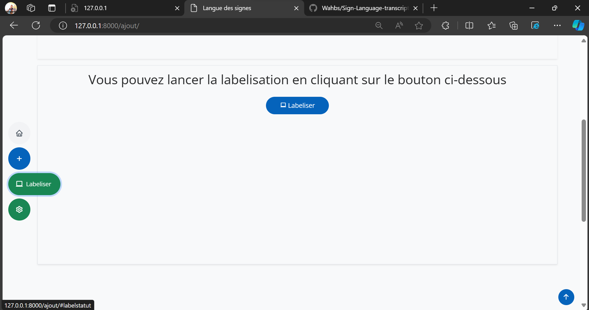
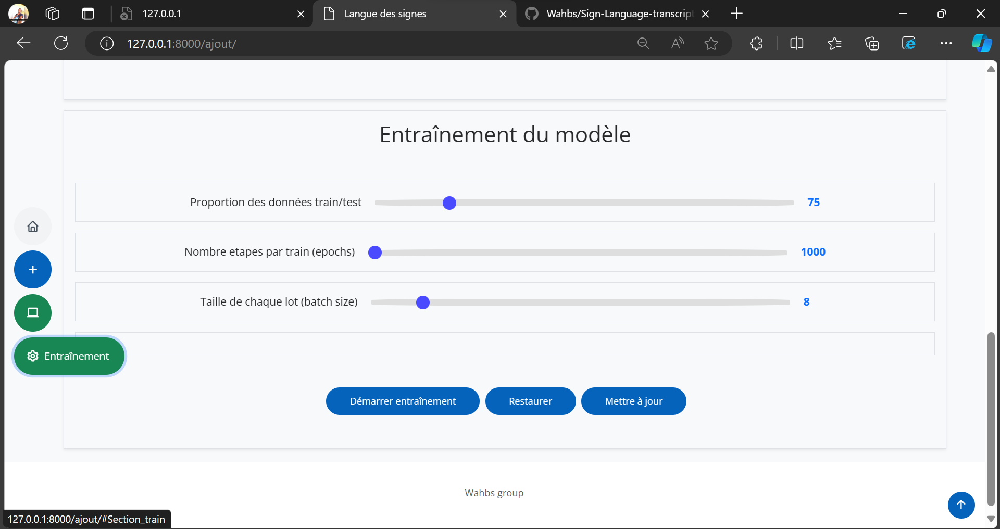

# Sign-Language-transcript
C'est une plateforme de transcription de langage de signe dévéloppé avec le framework web Django qui utillise le modèle Deep Learning pré-entrainé (SSD MobileNet).

## SSD MobileNet, Pourquoi ce choix ?
SSD MobileNet une architecture de réseau de neurones convolutifs (CNN), elle est choisie pour sa combinaison de précision et d'efficacité. Cette architecture est spécialement conçue pour des tâches de détection d'objets en temps réel, ce qui en fait un choix idéal pour la détection des signes dans des séquences vidéo.

## Methodologie 
  - La Collecte de Données : Une base de données de gestes de langage des signes est créée, comprenant une variété de signes couramment utilisés que nous avons formés nous-même, ensuite nous les avons labelisé à l'aide de LabelImg.
  - Prétraitement des Données : Les données sont prétraitées pour être compatibles avec le modèle, y compris la conversion en images et l'étiquetage approprié.
  - Entraînement du Modèle : Le modèle SSD MobileNet est entraîné sur ces données pour apprendre à détecter efficacement les gestes du langage des signes.
  - Évaluation et Réglages : Le modèle est évalué et ajusté pour optimiser la précision de la détection.

## Resultat
### Page d'accueil de la plateforme

### Page d'information

### Page de detection

### Affichage du texte recuperé lors de la transcription

### Page pour ajouter un nouveau mot dans le dataset

### Page pour labeliser les nouvelles images correspondant aux nouveaux mots

### Page pour re-entrainer un nouveau modele avec les nouvelles images
